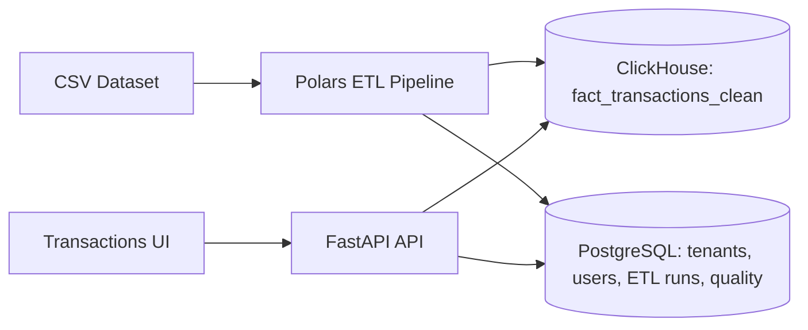

# Multi-Tenant Analytics System

This project ingests large CSV transaction data, validates it with a Polars-based ETL, stores analytics-ready facts in ClickHouse, and serves results through a FastAPI backend and a web UI. It is intentionally multi-tenant: every query is scoped so tenants only see their own data.

## What it does

- Ingests multi-million-row CSV datasets.
- Normalizes schema and validates data quality during ETL.
- Loads a clean fact table into ClickHouse (`fact_transactions_clean`).
- Stores tenants, users, ETL runs, and quality findings in PostgreSQL.
- Exposes analytics and transaction views via API and UI with server-side pagination.

## Architecture



## Why ClickHouse

ClickHouse is built for analytics at scale: columnar storage, fast aggregations, and efficient scans over wide fact tables. It is the right fit for transaction-level analytics on millions of rows.

## Why PostgreSQL

PostgreSQL stores transactional metadata: tenants, users, roles, ETL runs, and quality findings. This data is relational, frequently updated, and requires strict consistency.

## Multi-tenancy and access model

- Every fact row includes a `tenant_id`.
- API requests are authenticated and scoped to the tenant.
- Admin users see all tenant rows.
- Normal users are additionally scoped by `owner_user_id`.
- Guest users are read-only with smaller page-size limits.

This enforces tenant isolation at both the API and data layers.

## Pagination behavior

The transactions endpoint is fully server-side:

- Parameters: `page` (1-based), `page_size` (alias: `pageSize`).
- Offset: `(page - 1) * page_size`.
- Sorting: `order_date`, `total_amount`, `quantity`.
- Guests are capped to `page_size <= 25`.

This keeps response times stable as dataset size grows.

## Data correctness guarantees

- Required transaction columns are enforced after transformation.
- Missing/blank ratios are tracked per column.
- Parse failures are recorded for numeric and timestamp fields.
- Duplicate transaction IDs are detected.
- Outliers are computed post-load for sanity checks.
- ClickHouse schema drift is handled by adding missing columns automatically.

Quality summaries and findings are stored in PostgreSQL for auditing.

## Test suites

Black-box QA tests validate correctness without importing ETL internals:

- ETL output correctness (required columns, null ratios).
- ClickHouse integrity (data exists, critical fields healthy).
- API pagination (offsets, non-overlap, `pageSize` behavior).
- Multi-tenant isolation (tenant and owner filters match ClickHouse).

Benchmark tests measure ClickHouse performance and multi-tenant concurrency. See `BENCHMARK.md` for methodology and interpretation.

## Debugging data issues

If a column is missing or unexpectedly NULL:

1. Inspect CSV headers:
   ```bash
   Get-Content -TotalCount 1 data\large_dataset.csv
   ```
2. Run a dry-run ETL:
   ```bash
   docker compose exec api python -m app.etl.run --tenant alpha-store --csv /data/large_dataset.csv --dry-run
   ```
3. Inspect ETL logs for:
   - "Explicit CSV mapping"
   - "Transformed schema"
   - "Columns with >95% nulls"
4. Inspect ClickHouse schema:
   ```bash
   docker compose exec clickhouse clickhouse-client --query "DESCRIBE TABLE analytics.fact_transactions_clean"
   ```

## Seeded tenants and users

Initial seed creates two tenants with three users each:

- Tenant `alpha-store`
  - `admin@alpha.example.com` / `password123` (Admin)
  - `user@alpha.example.com` / `password123` (NormalUser)
  - `guest@alpha.example.com` / `password123` (Guest)
- Tenant `beta-shop`
  - `admin@beta.example.com` / `password123` (Admin)
  - `user@beta.example.com` / `password123` (NormalUser)
  - `guest@beta.example.com` / `password123` (Guest)

## Run the ETL

The API container mounts `./data` to `/data`:

```bash
docker compose exec api python -m app.etl.run --tenant alpha-store --csv /data/large_dataset.csv
```

## Run tests

Full suite:

```bash
docker compose exec api pytest
```

QA suite only:

```bash
docker compose exec api pytest backend/app/tests/qa
```

Benchmark suite:

```bash
docker compose exec api pytest app/tests/benchmarks
```

Optional test environment variables:

- `ANALYTICS_API_BASE_URL` (default: `http://localhost:8000`)
- `ANALYTICS_API_TIMEOUT` (default: `15`)
- `CLICKHOUSE_HOST`, `CLICKHOUSE_PORT`, `CLICKHOUSE_USER`, `CLICKHOUSE_PASSWORD`, `CLICKHOUSE_DATABASE`
- `QA_PASSWORD` and overrides like `QA_ALPHA_ADMIN_EMAIL`
- `QA_REQUIRED_MAX_NULL_RATIO`, `QA_CRITICAL_MAX_NULL_RATIO`
- `BENCHMARK_ITERATIONS`, `BENCHMARK_PAGE_SIZE`
- `QA_CONCURRENT_REQUESTS_PER_TENANT`, `QA_MAX_LATENCY_SECONDS`, `QA_TENANT_PAGE_SIZE`

## Project layout

```text
backend/app/
  main.py
  core/       # config, logging, security, dependencies
  db/         # models, session, migrations, clickhouse
  auth/       # auth routes and services
  tenants/    # admin user management
  etl/        # ETL pipeline and CLI
  quality/    # quality API routes
  analytics/  # analytics API routes
  web/        # UI templates and routes
  tests/      # pytest suites
```
