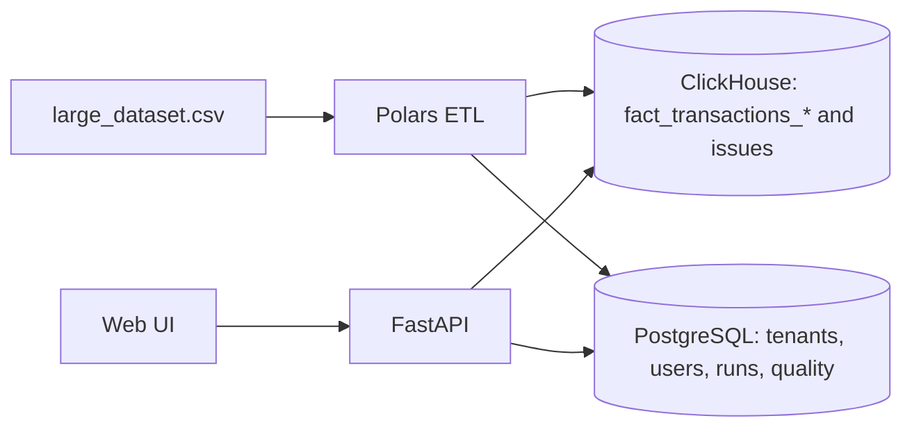

# Data Warehouse & Analytics Platform

## 1. Project Overview

This project is a multi-tenant analytics platform for large, messy e-commerce transaction datasets. It ingests raw CSV data, runs a Polars-based ETL, writes analytics facts to ClickHouse, stores operational metadata and quality reports in PostgreSQL, and serves dashboards plus ad-hoc analytics through a FastAPI backend and web UI.

It solves the core case study problem: detect data quality issues at scale, make the data analytically safe, and present fast, scoped insights to different user roles without data leakage.

The architecture separates OLTP (PostgreSQL) from OLAP (ClickHouse) to keep operational metadata consistent while enabling sub-second analytics on millions of rows. This split also keeps the API stateless and horizontally scalable.

Executive summary: an end-to-end data warehouse and analytics system that prioritizes correctness, quality visibility, and tenant isolation while remaining fast enough for interactive exploration on a large synthetic dataset.

## 2. Dataset Description & Intent

The dataset is defined in DATASET_README.pdf and is intentionally dirty by design:

- File: large_dataset.csv
- Size: ~1 GB
- Rows: 5,000,000
- Columns: 26
- Content: e-commerce transaction data
- Nature: synthetic data with intentional quality problems (typos, inconsistencies, anomalies)

This project treats data quality as a first-class concern.

The dataset exists to test both analytics correctness and the ability to detect and report real-world data quality issues, not just to compute aggregates.

## 3. System Architecture

PostgreSQL (OLTP):
- Users, tenants, roles
- ETL runs, quality reports, and findings

ClickHouse (OLAP):
- Analytics fact tables (clean, issue, all)
- Raw audit table and issue rows table

Why separation:
- Operational metadata needs strict consistency and frequent updates.
- Analytics needs columnar storage and fast aggregation at scale.

Stateless API design:
- JWT-based authentication
- No server-side sessions
- All scoping enforced per request

Architecture diagram:



Data flow:
- Ingestion -> ETL -> Quality Rules -> Analytics -> UI

## 4. Authentication & Authorization Model

Roles:

ADMIN
- Full system access
- User management
- Global analytics

NORMAL USER
- Authenticated
- Owner-scoped analytics only
- No admin privileges

GUEST
- Read-only
- Demo and exploration role

Auth model:
- JWT-based authentication for API and web UI.
- Tokens include user id (sub) and tenant_id; guest tokens also include role and email.
- Backend enforces tenant and role scoping on every request.
- Frontend gating is only for UX; it does not replace authorization checks.

## 5. ETL Pipeline & Data Flow

The ETL runs in batch mode and is optimized for large CSVs:

1. Stream CSV in batches to keep memory bounded.
2. Normalize headers and parse types to a canonical schema.
3. Assign tenant_id and owner_user_id for downstream scoping.
4. Evaluate deterministic quality rules (missing data, mismatches, consistency checks).
5. Write raw rows to ClickHouse raw audit table for traceability.
6. Split output:
   - Clean rows -> fact_transactions_clean
   - Issue rows -> fact_transactions_issue
   - All rows -> fact_transactions_all
   - Issue details -> fact_transactions_issues
7. Persist quality summary and findings in PostgreSQL.

Issues are detected during ETL to keep analytics fast and to avoid recomputing validations at query time.

## 6. Data Quality Framework

- Rule-based validation system executed during ETL.
- Severity levels: error, warn, info.
- Issues are deduplicated per row per rule code.
- Findings are stored for audit and surfaced in the Quality UI.

Examples of detected problems:
- Missing required fields
- Duplicate transaction_id
- Financial total mismatches (quantity, unit_price, discount, tax)
- Geography inconsistencies (country-city, region-country)
- Postal code format and phone-country plausibility (best effort)
- Invalid status or payment method values
- Category and department normalization issues
- Temporal uniformity dataset-level warning

Clean data definition is intentionally strict; semantic issues are surfaced, not discarded.

## 7. Analytics & Dashboards

Available pages:
- Dashboard: KPI tiles and trends
- Transactions: row-level explorer with server-side pagination
- Quality: operational quality summary, issues explorer, and issues analytics
- Analytics Explorer: ad-hoc metrics and dimensions with auto charts

Scope selection:
- Analytics can be queried by ALL, CLEAN, or ISSUE scopes.
- Normal users are restricted to CLEAN scope by backend enforcement.

Note on uniform distributions:
- The dataset is synthetic, so some distributions appear unusually uniform.
- This is expected and documented in the dataset intent.

All analytics responses respect tenant and role scoping.

## 8. Multi-Tenant & Parallel User Support

Tenant isolation strategy:
- Every fact row includes tenant_id.
- Requests are scoped by tenant_id and, for normal users, owner_user_id.
- Guest users are read-only and scoped to a tenant.

Parallel user verification:
- Automated QA tests validate tenant isolation and owner scoping.
- A concurrent multi-user test issues requests across 3 tenants in parallel.
- This validates correctness under concurrency, not throughput or load.

## 9. API Overview

Authentication:
- POST /auth/login - issue JWT for existing user
- POST /auth/signup - create NormalUser and issue token
- POST /auth/guest - issue read-only guest token
- GET /auth/me - return current identity and scope

Analytics (authenticated; role-scoped):
- GET /analytics/kpis
- GET /analytics/timeseries
- GET /analytics/top-products
- GET /analytics/breakdown
- GET /analytics/customer-segments
- GET /analytics/transactions
- GET /analytics/filter-options
- POST /analytics/ad-hoc

Quality (authenticated; role-scoped):
- GET /quality/latest
- GET /quality/overview
- GET /quality/findings
- GET /quality/issues
- GET /quality/issues/{transaction_id}
- GET /quality/issues-analytics

Admin-only:
- GET /admin/users
- POST /admin/users

Interactive OpenAPI docs are available at /docs.

## 10. Running the Project

Prerequisites:
- Docker and Docker Compose

Steps:

1. Build and start services:
   ```bash
   docker compose up -d --build
   ```

2. Ensure the dataset is available at ./data/large_dataset.csv (mounted to /data in the API container).

3. Run ETL for a tenant:
   ```bash
   docker compose exec api python -m app.etl.run --tenant alpha-store --csv /data/large_dataset.csv
   ```

4. Open the UI:
   - http://localhost:8000

Optional test user creation (for QA concurrency tests):

```bash
docker compose exec api python -m app.scripts.create_test_users
```

## 11. Testing Strategy

The test suite focuses on correctness rather than load testing:

- Unit-level checks for quality computations.
- Integration tests for ETL output and ClickHouse integrity.
- QA tests for pagination, tenant isolation, and role scoping.
- Parallel multi-tenant concurrency test for correctness under simultaneous requests.
- Optional benchmarks for ClickHouse query behavior.

Run tests:

```bash
docker compose exec api pytest
```

QA-only:

```bash
docker compose exec api pytest app/tests/qa
```

## 12. Known Limitations & Design Trade-offs

- Synthetic data limits realism; distributions can appear uniform by design.
- API documentation is limited to OpenAPI and README, not a full external spec.
- UI accessibility has not been formally audited.

These trade-offs keep the scope focused on correctness, architecture, and evaluation criteria for the case study timeline.

